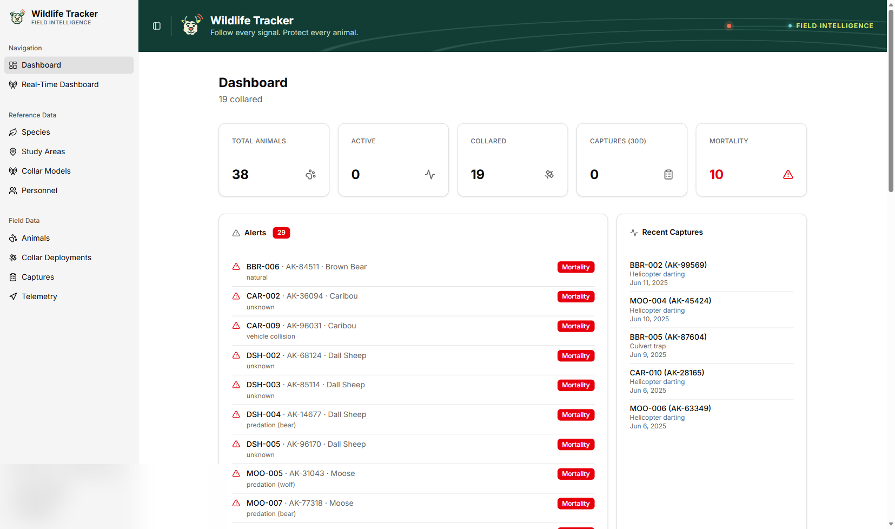
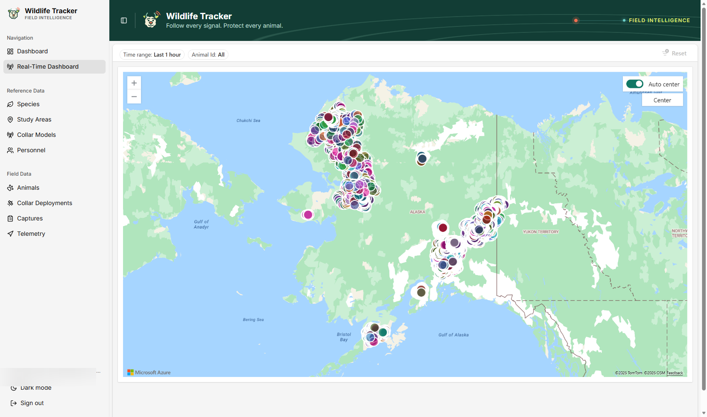
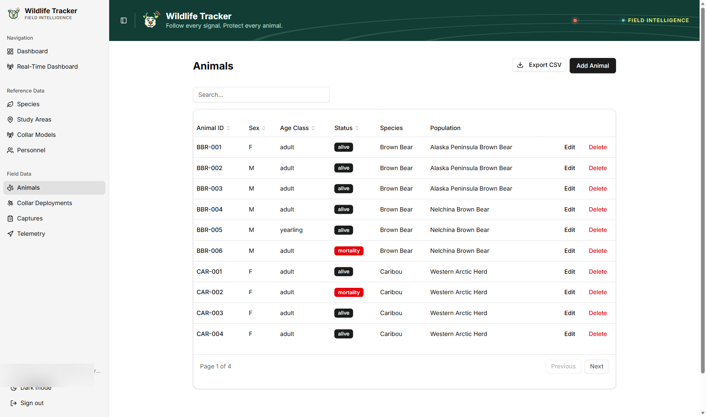
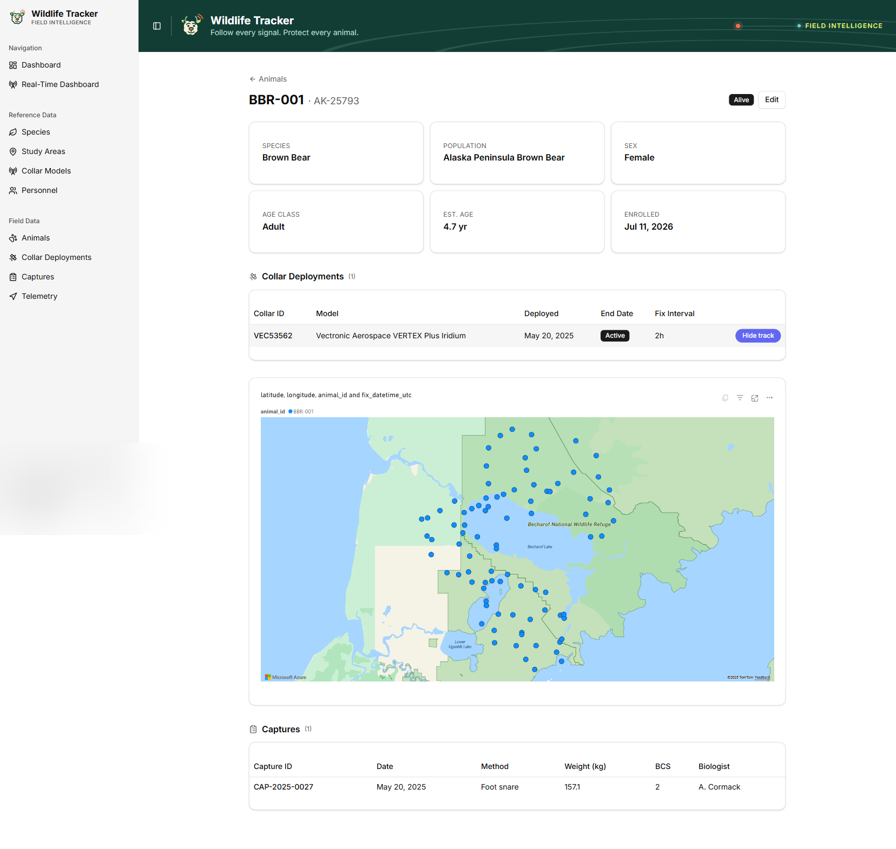

# Wildlife Tracker

A full-stack wildlife telemetry tracking application built with [Rayfin](https://aka.ms/rayfin), React, and shadcn/ui, deployed to Microsoft Fabric.

**Live app:** https://snowy-wren-b7eae0367b-northcentralus.webapp.fabricapps.net

## Overview

Wildlife biologists and field technicians spend significant time managing GPS collar data across disconnected spreadsheets, per-study databases, and proprietary vendor portals. There is no single place to cross-reference capture records, collar health, and real-time telemetry — making it hard to detect equipment failures, mortality events, or coverage gaps before they become costly.

## Target user

- **Wildlife biologists and researchers** who deploy GPS collars on wild animals (ungulates, carnivores, birds) and need to monitor fleet health and animal status from the office or the field.
- **Field technicians** who record capture data and collar deployments and need a fast, mobile-friendly data-entry interface.
- **Project managers** who need summary dashboards and exportable datasets for grant reporting and regulatory submissions.

## Microsoft Fabric technologies

- **Fabric SQL Database** for relational wildlife, capture, collar, and telemetry data
- **Fabric Eventstream** for real-time telemetry ingestion
- **Fabric KQL Database** for real-time telemetry storage and analysis
- **Fabric Real-Time Dashboard** for live animal locations and collar telemetry visualization
- **Power BI semantic model and report** for animal-specific GPS track visualization
- **Fabric Static Web Apps** for hosting the React application
- **Fabric SSO with Microsoft Entra ID** for authentication in the deployed application
- **Rayfin and Data API Builder** for typed data APIs, schema deployment, and access control

## Architecture

The React application uses the typed Rayfin client to access a Fabric SQL Database through Data API Builder. Fabric Eventstream and a KQL Database feed the Real-Time Dashboard. Power BI provides animal-specific GPS maps. The deployed app is hosted by Fabric and authenticated with Microsoft Entra ID.

## Features

- Summary dashboard with alerts, recent captures, charts, and live telemetry
- CRUD pages for animals, captures, collar deployments, and reference data
- Search, sorting, pagination, and CSV export
- Animal detail pages with capture history and a filtered Power BI GPS map
- Telemetry page with deployment filters, the same Power BI map, and a fix log
- Collapsible navigation, light and dark themes, and Fabric SSO

## Screenshots

Screenshots show the deployed application with live Microsoft Fabric data and embedded analytics.

| Dashboard | Real-Time Dashboard |
|---|---|
|  |  |

| Animals | Animal detail |
|---|---|
|  |  |

## Data model

| Entity | Purpose |
|--------|---------|
| `Animals` | Identity, biology, status, species, and study area |
| `Captures` | Capture event, measurements, samples, and personnel |
| `CollarDeployments` | Collar assignment, interval, and deployment dates |
| `TelemetryFixes` | Timestamped GPS and sensor readings |
| `Species`, `StudyAreas`, `CollarModel`, `Personnel` | Shared reference data |

## Getting started

```bash
# Install dependencies
npm install

# Start Rayfin services and the Vite development server
npm run dev
```

Open [http://localhost:5173](http://localhost:5173). Local development uses password authentication; the deployed app uses Fabric SSO.

## Embed configuration

Register a Microsoft Entra SPA and add `<app-origin>/fabric-embed-redirect.html` as a redirect URI. Grant these delegated permissions:

- **Power BI Service:** `Fabric.Embed`, `KQLDashboard.Read.All`, `Workspace.Read.All`, `Item.Read.All`, and `Report.Read.All`. Consent these scopes together so a later grant does not replace the existing Fabric permissions.
- **Azure Data Explorer:** `user_impersonation`
- **Microsoft Graph:** `User.Read`

Configure `rayfin/.env`:

```bash
RAYFIN_PUBLIC_REALTIME_DASHBOARD_CLIENT_ID=<entra-app-client-id>
RAYFIN_PUBLIC_REALTIME_DASHBOARD_ITEM_ID=<real-time-dashboard-item-id>
RAYFIN_PUBLIC_POWERBI_TELEMETRY_REPORT_ID=<power-bi-report-id>
RAYFIN_PUBLIC_POWERBI_TELEMETRY_REPORT_EMBED_URL=<power-bi-report-embed-url>
RAYFIN_PUBLIC_POWERBI_TELEMETRY_REPORT_URL=<power-bi-browser-url>
```

The signed-in user must have access to both embedded items. The Power BI report must expose `Query.animal_id`, `latitude`, `longitude`, and `fix_datetime_utc`. Use `animal_id` as the Azure Maps series and `fix_datetime_utc` as its path identifier. Use a 16:9 report page.

## Deploy

```bash
npx rayfin login          # authenticate with Entra ID
npx rayfin up             # build, deploy static app, and apply schema migrations
npx rayfin up status      # verify endpoint health
```

## Repository layout

- `src/` - React pages, components, hooks, and services
- `rayfin/data/` - Rayfin entity definitions
- `rayfin/rayfin.yml` - Fabric service and authentication configuration
- `data/` - sample CSV data and SQL seed scripts
- `fabric-embed-redirect.html` - MSAL redirect page for embedded analytics

## Scripts

| Command | Description |
|---------|-------------|
| `npm run dev` | Start Rayfin services without static hosting, then start Vite |
| `npm run build` | Production build |
| `npm run build:fabric` | Build for Fabric static hosting (used by `rayfin up`) |
| `npm run lint` | Lint with ESLint |
| `npm run test` | Run unit tests with Vitest |
| `npm run rayfin:db` | Apply schema migrations only |
